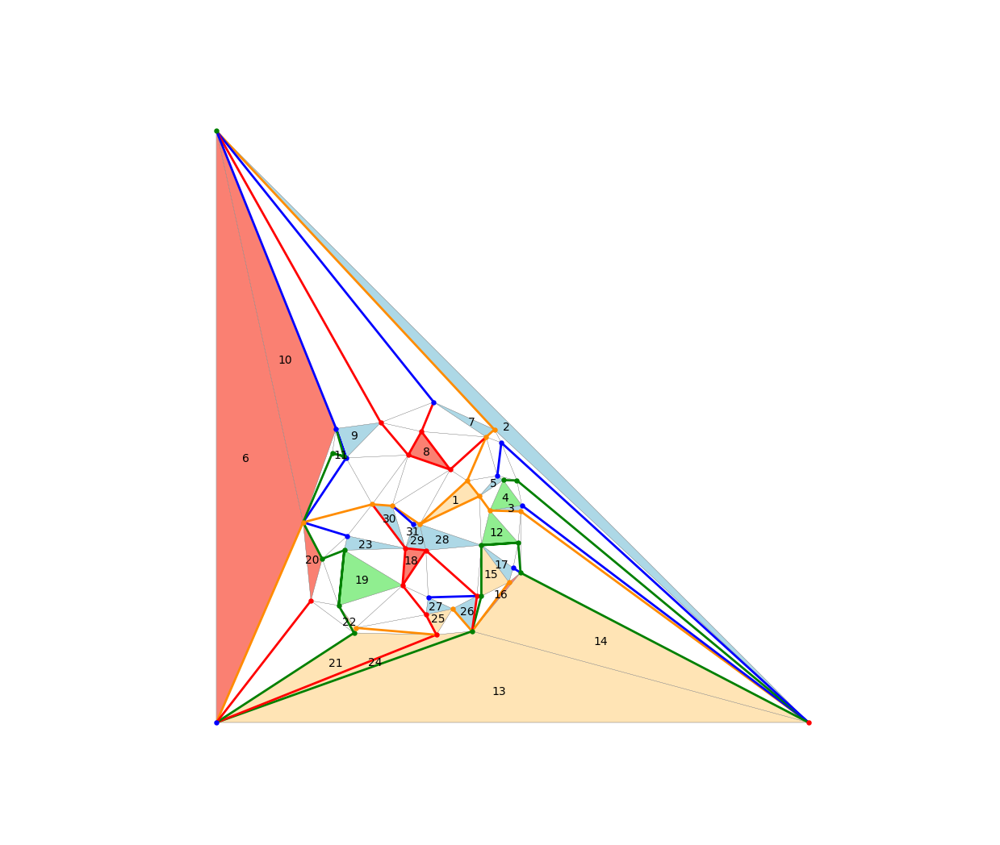
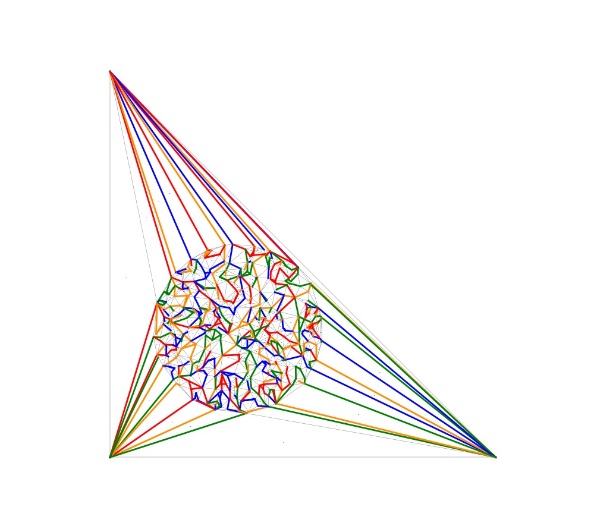
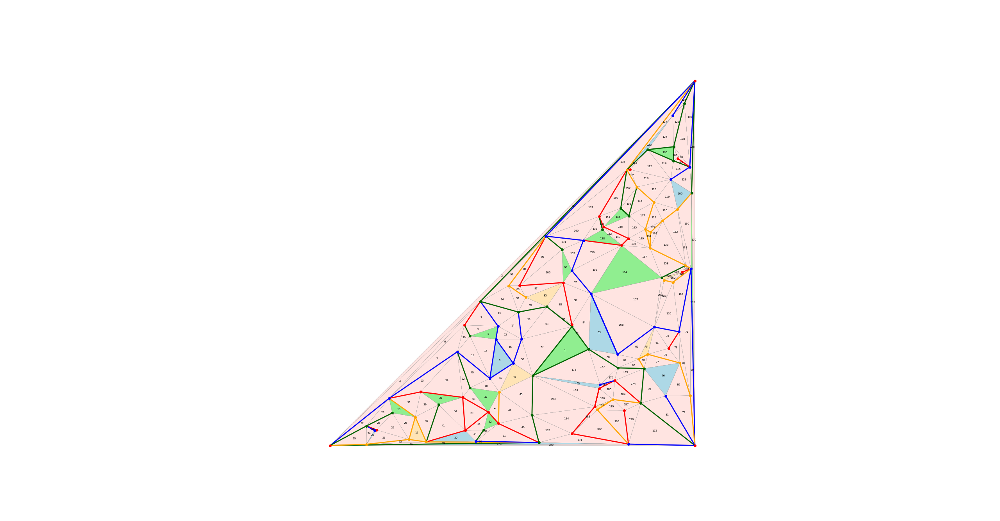

# An Implementation of the Product Structure Theorem for Planar Graphs

An implementation of layered H-partitions, a.k.a, the Product Structure Theorem for planar graphs.  This implements the algorithm described in [arXiv:2004.02530](https://arxiv.org/abs/2004.02530).

# lhp.py

`lhp.py` is a module that includes the `tripod_partition` class and is also a standalone command-line program.

## The `tripod_partition` class

The useful thing for programmers is the `tripod_partition` class, whose constructor requires an embedding of a planar triangulation *G* with vertex set \{0,..,*n*-1\} and a list of three vertices `outer_face` that lists the vertices of some face in counterlockwise order.

The triangulation *G* must be described as a list `succ` of length *n*. The list entry `succ[i]` is a dictionary that maps each neighbour *j* of *i* onto the neighbour *k* of *i* that appears immediately after *j* when ordering the neighbours of *i* in counterclockwise order around *i*.  Specifically, `(i,j,k)` is a triangular face of *G*.  For any directed edge `ij`, `succ[i][j]` is the third vertex of the face to the left of `ij`.

If you have a standard adjacency list representation of *G* you can use the following function to convert it to the formatted needed by the `tripod_partition` constructor:

    def al2succ(al):
        succ = list()
        for neighbours in al:
            succ.append(dict())
            for i in range(len(neighbours)):
                succ[-1][neighbours[i]] = neighbours[(i+1)%len(neighbours)]
        return succ

After constructing it, the tripod partition has several parts:

- `t`: This is a BFS tree rooted at `roots`.  This tree represented as a array of length *n*. For each `i` in \{0,...,`n`-1\}, `t[i]` is the list of nodes adjacent to `i` beginning with the parent node, so `t[i][0]` is the parent of `i` in the BFS tree.  The parent of each outer face node is `-1`, so `t[j][0] = -1` for each j in `outer_face`.
- `tripods`: This is a list of closed *tripods*.  Each tripod is a list of 3 vertical paths in the BFS tree T.  The set \{`tripods[i][j][:-1]` : 0&le; `i` < len(tripods), 0&le; `j`<3 \}  is a partition of the vertices of *G*.  **Note:** Pay attention to the `[:-1]`; each of these three lists contains one extra vertex that is part of the parent tripod.  
- `tripod_map`: This is a list of length *n* that maps each *v* vertex of *G* onto a triple `(ti,l,j)` where `ti` is the tripod that contains *v*, `l` is the leg that contains *v* and `j` is the location of *v* in this leg.  So, if `(ti,l,j) = tripod_map[v]` then `tripods[ti][l][j]=v`.
- `tripod_tree`: This is a list of length `len(tripods)` that encodes a 3-ary tree whose nodes are tripods.  This tree has the property that `tripods[i][j][:-1]` (a vertical path in `t`) has no vertex adjacent to any tripod in the subtree `tripod_tree[i][j]`.  (Leg *j* of the tripod is separated from all tripods contained in subtree *j*.)  A useful property of these tripods is that they are ordered by a preorder traversal of the tripod tree.  If tripod `a` is an ancestor of tripod `t`, then this makes it possible to know, in constant-time, which of the three subtrees of `a` contains `t`.

The `tripod_tree`, `tripods`, and `tripod_map` can be used to obtain a width-3 tree-decomposition of the planar graph H_3 obtained from *G* by contracting each tripod.  They can also be used to obtain a width-8 tree-decomposition of the planar graph obtained by contracting each leg of each tripod.  These graphs are implicitly represented by the functions `h3parents(t)` and the functions `h8parents(t, i)`.

## Standalone program

The lhp.py module can also be used as a standalone program that reads a triangulation from stdin and outputs a list of tripods to stdout.

The input represents a graph with vertex set 0,..,.n-1.
- Line 0 of the input is f = 2*n - 4
- Each of lines 1,...,f in the input is a triangular face
The vertices of each triangular face must be listed in counterclockwise order

The output represents the closed tripods in a tripod partition.
- Line 0 is the number k of tripods
- Lines 3i-2, 3i-1, 3i are the legs of tripod i (for each i in {1,...,k})
Each leg of the tripod begins with a vertex of the Sperner triangle and ends at a vertex in one of the three parent tripods.

If f is of the form 2*n - 5, instead of 2*n - 4, then the program assumes that there is an additional face [0,1,2] or [2,1,0] that is missing and adds it. This makes it compatible with `qhull`. In particular, the following command line works:

    rbox y 100 D2 | qhull d Qt i | python3 lhp.py

# lhp_demo.py

Unfortunately, this demo requires `scipy.spatial` (which uses `qhull`) for generating random Delaunay triangulations

    ./lhp_demo.py -h
    Computes a tripod decomposition of a Delaunay triangulation
    Usage: ./lhp_demo.py [-h] [-c] [-r] [-y] [-w] [-b] [-nv] <n>
      -h show this message
      -c use collinear points
      -y use random points in triangle
      -r use random points in disk (default)
      -w use O(n log n) time algorithm (default)
      -b use O(n^2) time algorithm (usually faster)
      -nv don't verify correctness of results
      <n> the number of points to use (default = 10)

If *n* &lt; 500 then this program will show the result in a matplotlib window, producing pictures that look like this:

Run `lhp_demo.py -h` for a list of options
