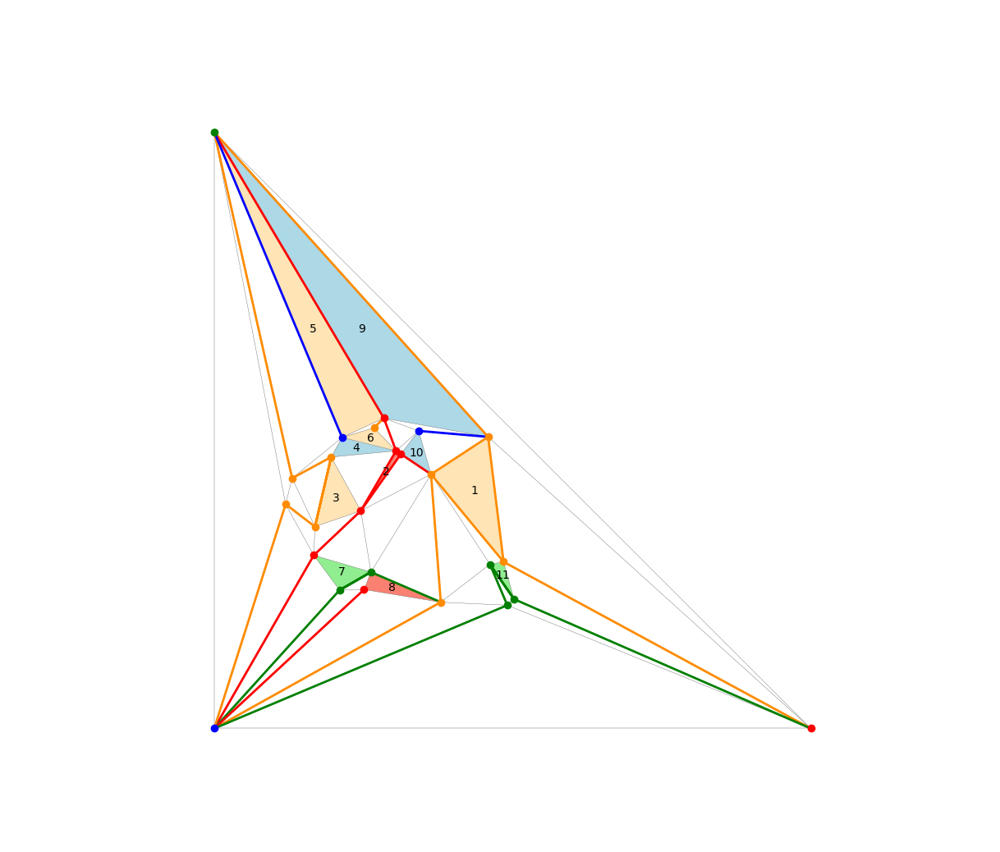

An implementation of layered H-partitions, a.k.a, the Product Structure Theorem for planar graphs.  This implements the algorithm described in [arXiv:2004.02530](https://arxiv.org/abs/2004.02530).

The useful thing here is the *tripod_decomposition* class, whose constructor requires an embedding of a planar triangulation G with vertex set \{0,..,*n*-1\} and with outer face (2,1,0).

The graph *G* must be described as a list *succ* of length *n*. The list entry *succ[i]* is a dictionary that maps each neighbour *j* of *i* onto the neighbour *k* of *i* that appears immediately after *j* when ordering the neighbours of *i* in counterclockwise order around *i*.  Specifically, *(i,j,k)* is a triangular face of *G*.

If you have an embedding of G represented as a standard adjacency list you can use the function *al2succ(al)* in lhp_demo.py to convert to the format we need.

The algorithm constructs a BFS tree T rooted at [0,1,2].  After constructing it, the tripod decomposition contains a list of *tripods*. Each tripod is a list of 3 vertical paths in the BFS tree T.

As a side-effect, this algorithm computes a 4-colouring of G such that

- all vertices of each tripod have the same colour (so this is really a colouring of the tripods)
- if two tripods have the same colour then there is no edge between them.

The program lhp_demo.py produces pictures that look like this:

