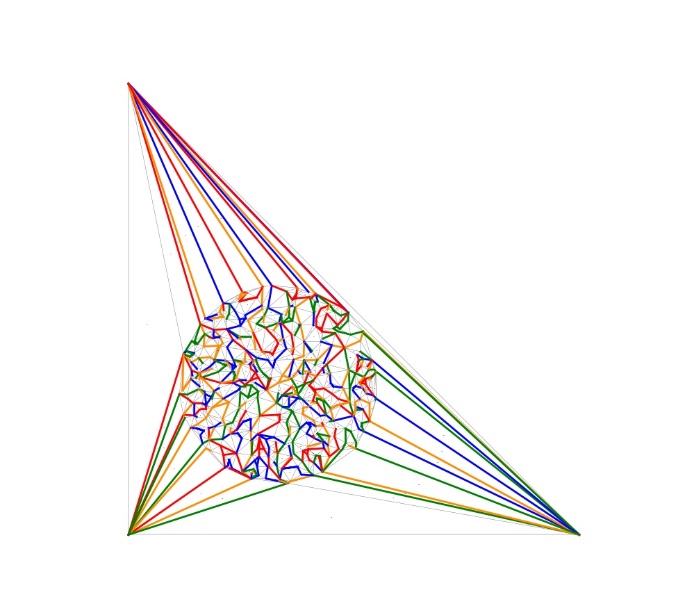

# An Implementation of the Product Structure Theorem for Planar Graphs

An implementation of layered H-partitions, a.k.a, the Product Structure Theorem for planar graphs.  This implements the algorithm described in [arXiv:2004.02530](https://arxiv.org/abs/2004.02530).

## lhp_demo.py

    ./lhp_demo.py -h
    Computes a tripod decomposition of a Delaunay triangulation
    Usage: lhp_demo.py [-c] [-r] [-w] [-b] [<n>]
      -c use collinear points
      -r use random points (default)
      -w use O(n log n) time algorithm (default)
      -b use O(n^2) time algorithm (usually faster)
      <n> the number of points to use

## The `tripod_decomposition` class

The useful thing here is the `tripod_decomposition` class, whose constructor requires an embedding of a planar triangulation G with vertex set \{0,..,*n*-1\} and with outer face (2,1,0).

The graph *G* must be described as a list `succ` of length *n*. The list entry `succ[i]` is a dictionary that maps each neighbour *j* of *i* onto the neighbour *k* of *i* that appears immediately after *j* when ordering the neighbours of *i* in counterclockwise order around *i*.  Specifically, *(i,j,k)* is a triangular face of *G*.  For any directed edge *ij*, `succ[i][j]` is the third vertex of the face to the left of *ij*.

If you have an embedding of G represented as a standard adjacency list you can use the function *al2succ(al)* in lhp_demo.py to convert to the format we need.

After constructing it, the tripod decomposition has several parts:

- `t`: This is a BFS tree rooted at [0, 1, 2].
- `tripods`: This is a list of *tripods*.  Each tripod is a list of 3 vertical paths in the BFS tree T.  The set \{tripods[i][j][:-1] : 0<= i < len(tripods), 0<= j<3 \}  is a partition of the vertices of G.  **Note:** Pay attention to the `[:-1]`; each of these three lists contains one extra vertex that is technically not in the tripod.
- tripod_map: This is a list of length *n* that maps each *v* vertex of *G* onto a triple `(ti,l,j)` where `ti` is the tripod that contains *v*, `l` is the leg that contains *v* and `j` is the location of *v* in this leg.  So, if `(ti,l,j) = tripod_map[v]` then `tripods[ti][l][j]=v`.
- `tripod_colours`: This is a list of length `len(tripods)` that assigns a colour `tripod_colours[i]` in \{0,1,2,3\} to the tripod `i`.  This is a proper colouring in the sense that, if two tripods receive the same colour then there is no edge between them in *G*.
- `tripod_tree`: This is a list of length `len(tripods)` that encodes a 3-ary tree whose nodes are tripods.  This tree has the property that `tripods[i][j][:-1]` (a vertical path in `t`) has no vertex adjacent to any tripod in the subtree `tripod_tree[i][j]`.  (Leg *j* of the tripod is separated from all tripods contained in subtree *j*.)

The `tripod_tree` can be used to obtain a width-3 tree-decomposition of the planar graph H_3 obtained from *G* by contracting each tripod.  It can also be used to obtain a width-8 tree-decomposition of the planar graph obtained by contracting each leg of each tripod.

## Demo Program

The program lhp_demo.py produces pictures that look like this:

